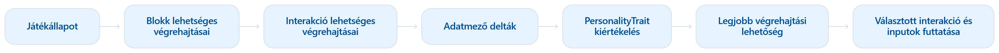

# Aktor döntéshozatali rendszer

## A nem játékos által irányított karakterek intelligens viselkedésformáit és interakció végzését megvalósító rendszer.

https://github.com/user-attachments/assets/f4d0dcf6-4926-469c-a4f4-307cb53d96d8

A stratégiai játékok célja, hogy két szemben álló fél által irányított játékbábuk csoportjából a miénk kerüljön ki győztesen a döntéshozatali és előrelátási képességeink megtornáztatásával. Ehhez elengedhetetlen egy olyan ellenfél, aki kihívást tud nyújtani a játékos számára ezeken a területeken. Egyjátékos játékok esetén ez a feladat a játékon belül futó algoritmusokra hárul. Egy erre szakosodott játék-keretrendszer alkotójaként meg kellett valósítanom az ilyen algoritmusok létrehozását olyan formázható módon, hogy az ne csak egy elképzelt játékmeneti stílust legyen képes kiszolgálni, hanem a műfaj bő keretein belül a lehető legsokoldalúbban felhasználható legyen.

Az erre készített rendszerem dizájnja az alábbi szegmensekből épül össze:
 - Interakció szemantikák: Az interakciókhoz használt építő kockák hatásainak delta-értékekbe való absztraktizációja a könnyű kiértékelhetőség céljából.
 - Aktor személyiségjegyek: Minden karakter, amelyet nem a játékos irányít, implementál egy objektumot, amely tartalmazza a saját céljainak meghatározását annak formájában, hogy milyen történéseket hogyan értékel.
 - Döntéshozatali rendszer: A személyiségjegyek és a rendelkezésre álló interakciók összehasonlítása és kiértékelése a célnak legjobban eleget tevő lépéssorozat megtalálására.



## Interakció szemantikák
Egy játék menetének legnagyobb része akörül forog, hogy az irányított aktoraink által birtokolt interakció objektumokat céltudatosan alkalmazzunk. Amennyiben képesek vagyunk elérni, hogy az aktorokat irányító algoritmus el tudja dönteni, hogy melyik interakcióval mit lehet elérni, azzal elő tudjuk készíteni számára ugyanezt a céltudatosságot. 

Ennek megvalósítására az interakciókat felépítő építőelemek (lásd: interakció editor dokumentáció) implementálnak egy Prediction nevű, "BlockExecutionOption" lista típusú metódust, amelyen keresztül úgynevezett delta értékek formájában leírják, hogy a lefuttatásukkor milyen változást érnek el a játék világában.
 
A BlockExecutionOption objektumok az adott blokk (interakció építőkocka) objektum egy lehetséges, szinguláris lefuttatásának adatait tartalmazzák: 
 - A blokk típusát, amelynek lehetséges lefutási eredményét képviselik.
 - A szükséges inputokat a jelölt lefutás gyakorlatbeli megvalósításához.
 - Egy "PropertyDelta" lista típusú mezőt, amely tartalmazza a befolyásolt mezőket és a befolyás mértékét.

Tehát ha például egy birtokolt interakció objektum egyik blokkja egy mozgás effektust ír le a négy égtáj irányainak egyikébe, akkor annak a blokknak a Prediction metódusa egy négy tagú BlockExecutionOption listát ad vissza a négy lehetséges irány után. Mind a négy ugyanazt a mozgás blokkot jelöli meg birtokosának, azonban (annak tudatában, hogy a mozgás a mozgatni kívánt objektum "oszlop" és "sor" mezőinek koordinátáinak változtatásában értelmezett) ugyanúgy a sor és az oszlop mezőket jelölik meg befolyásolt mezőkként, de mind a négyben különböző befolyás értékeket párosítva hozzájuk. Ugyan így jár el az összes további blokk amelyek szereplnek az interakcióban, mindegyik létrehozva a saját lehetséges lefuttatásait. Ezeket a BlockExecutionOption objektumokat egybefésülve megkaphatjuk az interakció összes lehetséges futtatási kombinációját. Az így kapott objektumokat "ActionExecutionOption"-nek hívják, mindegyik tartalmaz egy-egy BlockExecutionOption objektumot a képviselt interakció által tartalmazott összes blokk után.

## Aktor személyiségjegyek
Az interakciók hatásainak megértése után a következő lépés, hogy egyenként kiosszuk a nem játékos által irányított aktoroknak, hogy mik azok a célok, amelyeket el kell érniük a rendelkezésükre álló interakciókkal. Erre a célra létezik az aktor objektumok "PersonalityTraits" nevű, PersonalityTrait lista típusú mezője. Minden PersonalityTrait objektum egy törekvést ír le abban a formában, hogy milyen effekteket milyen keretek között mennyire értékeljen egy aktor. A játékmenet keretein belül, egy aktornak az irányítását azzal tudjuk a számítógépre bízni, ha ebbe a mezőbe felveszünk legalább egy elemet (üres lista esetén a karakter játékos által irányíthatóként van kezelve).

Egy PersonalityTrait objektum az alábbi fogalmakból tevődik össze:
 - Figyelendő mezők
 - Értékelő görbe
 - Súlyozás

Amikor egy interakció képes megváltoztatni egy olyan adatmezőt, amelyet az aktor egyik PersonalityTrait objektuma figyel, a változás delta-értékét paraméterként adjuk az értékelő görbének, amely által visszaszolgáltatott eredmény mutatja, hogy a személyiség elem mennyire tartja számára kedvezőnek az adott interakciót. A döntéshozatal előtt a kapott értéket továbbá megszorozzuk a súlyozás értékével, domináns és kevésbé domináns személyiségelemek létrehozását lehetővé téve.

### Értékelő görbék
Az értékelő görbékre matematikai funkciók formájában kell gondolni, a segítségükkel felettébb nagy szabadsággal szabhatjuk meg, hogy milyen intervallumokban számít jónak, nagyon jónak vagy akár egyenesen rossznak egy delta-értékekben mért effektus. Pl lineáris függvények használatakor mindig a minél nagyobb vagy kisebb input érték lesz pártolva (felhasználható például a kijelölt célpontjától mindig minél nagyobb távolságot kívánó személyiségelemekhez), de logaritmus függvénnyel pedig elérhetjük, hogy egy bizonyos szakasz felett ne is tegyen nagy különbséget a növekvő input értékek között (használatával elérhetjük, hogy egy egyszerű feladat elvégzéséhez ne preferálja a drágább interakciót, amennyiben akad olcsóbb lehetősége is ugyanazzal a végeredménnyel).

### Megfigyelt mezők
A figyelendő mező két forrásból is származhat: adatmező-csoportok vagy kontextus-elemek.

Az adatmező-csoportok alá tartozik minden olyan célkitűzés, amit az interakciók közvetlenül képesek befolyásolni, pl aktorok életerő vagy koordináta mezőinek a módosítása. Ez azzal történik, hogy a befolyásolható adatmezőkre generális fogalmakként tekintünk, függetlenül attól, hogy ki birtokolja az adott mezőt, amit az interakció befolyásol. Ha egy interakció befolyásolja a játékvilágon belül akárhol a megfigyelt adatmezőt, úgy az interakció kiértékelhető az adott PersonalityTrait objektum által. 
Az adatmezők csoportosításával a célokat tovább tudjuk generalizálni, például egy defenzív adatmező-csoport az életerőt és a védelmi erőt növelő, illetve a sebzést csökkentő effekteket egyaránt magában foglalná, hogy egy lineárisan növekvő értékelő görbével párosítsa őket egyetlen PersonalityTrait objektumban. Ezzel többé nem maguk a nyers effektek azok amiket az adott aktor értékelni fog, hanem általunk definiált koncepciók amelyek több forrásból is elérhetőek.

A kontextus-elemek alá tartoznak a további olyan célkitűzések, amiket az interakciók kizárólag közvetetten, mellékhatásként képesek elérni. Az elsődleges céljuk az adatmező-csoportok szabályozása olyan helyzetekkel szemben, ahol a célkitűzések saját maguk ellen dolgoznának. Például egy olyan aktornak, amelynek a célja, hogy gyógyító effektekkel lássa el a játékossal szemben álló karaktereket, pusztán adatmező-csoportokkal lehetetlen megtanítani, hogy csakis a saját csapattársait gyógyítsa és a játékos oldalát egyáltalán ne. Itt jönnek képbe a kontextus-elemek, amelyeknek a célja olyan adatok absztraktizálása, amelyek csak a játékvilág szemszögéből léteznek, de konkrét benne szereplő objektumok adatmezőiben nem. Ilyenek a különböző aktor frakciók megkülönböztetése vagy a célpontoktól való relatív távolság. Tehát létrehozhatunk PersonalityTrait objektumokat, amelyek negatívan értékelik a csapattársaink szabotálását és az ellenfeleink támogatását.

## Döntéshozatali rendszer
A rendelkezésre álló interakciók megértése és a célok deklarálása után az utolsó lépés megtalálni majd elvégezni a szituációhoz legjobban illő lépést. A rendszer ezen szegmense a játékmeneti ciklus részét képviseli, amikor egy nem játékos által irányított aktorra kerül a lépés, automatikusan meghívásra kerül.

A működése az alábbi lépésekben történik:

1. Az aktor által birtokolt összes interakció objektum összes legális futtatásának begyűjtése egy ActionExecutionOption típusú listába. A listában lévő objektumok mind egyedileg egy-egy teljes interakció lefuttatásához szükséges paramétereit és prediktív hatásait tartalmazzák.
2. A listában szereplő lehetőségek az őket birtokló aktor PersonalityTrait objektumaival való megmérése. Ha egy ActionExecutionOption objektum tartalmaz delta értékeket olyan adatmezőhöz, amelyeket figyelnek a birtokolt PersonalityTrait objektumok valamelyike, azok meg lesz mérve a releváns értékelő görbével. Az erekből kapott eredmények összeadásra kerülnek egy "maxScore" változóba. Ha az aktuális ActionExecutionObjektum nagyobb maxScore pontot ért el mint az eddig legnagyobbnak mért, úgy azt bemásoljuk egy bestOption változóba. 
3. Az összes lehetőség kiértékelése után a bestOption változó tartalmát lefuttatjuk. A játékos általi interakció lefuttatás esetén olykor élőben kell kiválasztani célpontokat egyes blokkok effektjeihez, de a nem játékos által irányítottak esetén a célpontok automatikusan kiválasztásra kerülnek az BlockExecutionOption objektumok létrehozásakor, ezek aztán átkerülnek a felhasználásra alkalmas ActionExecutionOption objektumokba.

### Pseudokód
```
FUNCTION ChooseAndExecuteAction(actor, context):
    executionOptions ← ∅
    FOR EACH action IN actor.ActionSet:
        options ← action.GenerateActionChoiceOptions(context)
        executionOptions ← executionOptions ∪ options

    bestOption ← null
    highestScore ← −∞
    FOR EACH option IN executionOptions:
        score ← 0

        FOR EACH delta IN option.Deltas:
            traits ← actor.GetTraitsForProperty(delta.PropertyDescriptor)
            FOR EACH trait IN traits:
                score ← score + trait.Curve.Evaluate(delta.Value) × trait.Weight

        FOR EACH trait IN actor.ContextTraits:
            featureValue ← trait.ContextFeature.Calculate(context, option)
            score ← score + trait.Curve.Evaluate(featureValue) × trait.Weight

        IF score ≥ highestScore:
            highestScore ← score
            bestOption ← option

    action ← bestOption.SourceGameAction
    context.ExecutingAction ← action
    currentBlock ← action.EntryBlock

    WHILE currentBlock ≠ null:
        FOR EACH input IN currentBlock.PreExecutionInputs:
            IF NOT context.Has(input):
                ResolveInput(bestOption, context)

        currentBlock ← Execute(context)
```

Ezzel az algoritmussal a nem játékos által irányított aktorok minden esetben a birtokolt PersonalityTrait objektumaiknak legjobban eleget tevő interakciókat és célpontokat fogják választani, de esetenként célszerűbb valamilyen szintű véletlenszerűséget helyezni a rendszerbe (például a második-harmadik legjobbra kiértékelt interakció vagy célpontcsoport választása az elsővel szemben) hogy színesebbé, kevésbé gépiessé tegyük az élményt.

## Szerkesztő
A leírt rendszer felhasználásra alkalmas állapotban van, de az összetevőinek szérializálását elősegítő grafikus szerkesztő felület még fejlesztés alatt áll, a dokumentáció ahhoz tartozó része hamarosan érkezik.
