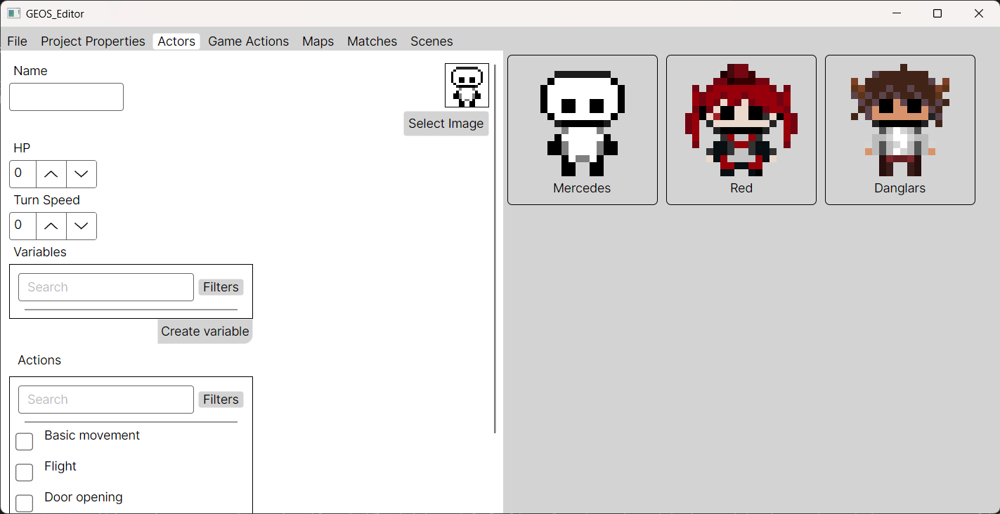
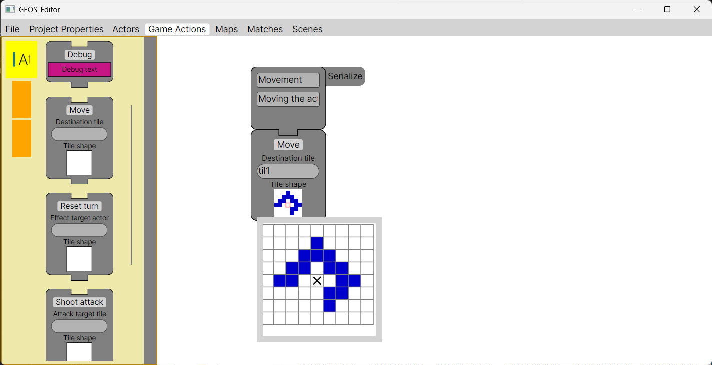
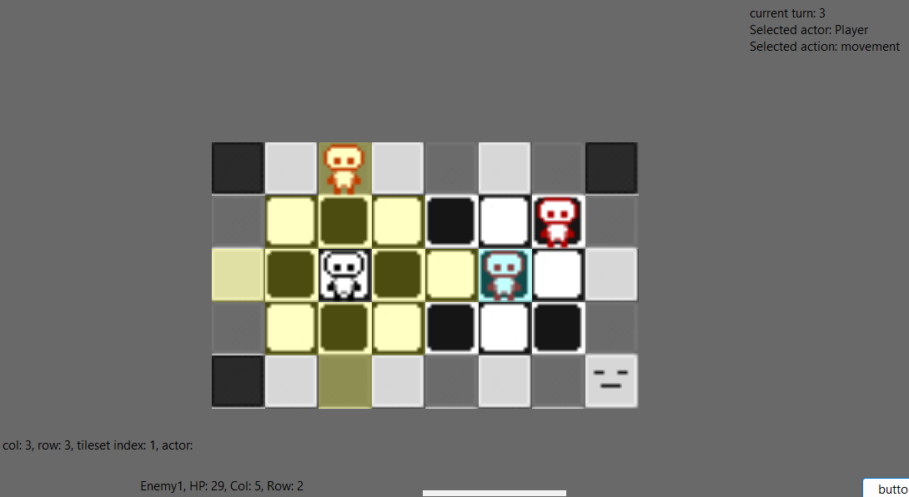

# GEOS System - játékfejlesztő motor piaci és otthoni használatra

## C#/.NET alapú játékmotor és grafikus szerkesztő körökre osztott stratégiai és RPG játékok készítéséhez.

<table>
  <tr>
    <td></td>
    <td></td>
  </tr>
  <tr>
    <td colspan="2" align="center">
      
    </td>
  </tr>
</table>

Egy solo-development projekt, amely a saját kedvenc játékaim működési elveinek megértésének vágyából indult, de egy ambiciózusabb céllá kerekedett ki. Az elsődleges célja egy olyan szoftver megalkotása, amely segítségével akár programozásban tapasztalatlan felhasználók is képesek személyre szabott játéktermékeket gyártani a meghatározott műfajok keretein belül, a végső ambíció pedig egy beépített online áruház és közösségi felület létrehozása, amelybe gombnyomással oszthatjuk meg akár a fejlesztőben készített játékainkat, akár saját gyártású fejlesztési kellékeket és tartalomegységeket.
A szoftver aktív fejlesztés alatt áll, az első publikus verzió tervezett megjelenése 2027 közepére várható. 

## Architektúra
A projekt két különálló rendszer együttműködésével működik:
 - A motor, amely egy tartalomtól függetlenül működő játék keretrendszer, a feladata, hogy minél szélesebb körű megvalósításokat képes legyen működtetni.
 - A fejlesztői felület, amelyben játékkellékeket (pályák, karakterek, interakciók, stb.) gyárthatunk, tárolhatunk és kombinálhatunk egy kész játékprogrammá.

A fejlesztőben készült kellékeket JSON formátumban tároljuk a fájlrendszerben, amelyek direkt módon felhasználhatók a motor rendszereiben. A különböző modulok a könnyű bővíthetőség jegyében épültek, támogatva a programozó felhasználók általi módosításokat.

## Kiemelt rendszerek:
 - [Gráf alapú grafikus programozó felület interakciók készítésére](Dokumentáció/Rendszer/Interakció-editor.md) | ✅Elkészült
 - [Személyre szabható döntéshozatali rendszer NPC aktorok viselkedésformáinak meghatározására](Dokumentáció/Rendszer/NPC-döntéshozatal.md) | ✅Elkészült
 - Rajzolás alapú dinamikus játékmező készítés | ✅Elkészült
 - Létrehozott tartalmak futási szempontoktól független JSON fájlokban történő tárolása | ✅Elkészült
 - Gameplay-loop rendszer és interaktálható játékfelület amely élőben kombinálja a fent említett rendszereket | ✅Elkészült
 - Nem-lineáris jelenetrendszer és statikus narratív elemek támogatása | Fejlesztés alatt
 - Fejlesztő felület a kellékek grafikus gyártására | Fejlesztés alatt
 - Játékprojektek futtatható termékké való építése | Fejlesztés alatt

## Technikai kihívások, fejlesztett kompetenciák
A projekt fő technikai kihívásai közé tartoznak a fejlesztési koncepciók menüalapú szerkesztőbe való átfordítása kompromisszumok bevezetése nélkül, illetve az újrafelhasználhatóságot, felhasználók általi bővíthetőséget támogató architektúrákhoz való adaptálás.

A fejlesztés során figyelembe kellett vennem a rengeteg felhasználhatósági módját minden egyes alkotó rendszernek, úgy felépíteni őket, hogy minél kevésbé legyen szűk az elképzelés arról, hogy milyen megvalósításoknak engedjenek teret. Eközben figyelembe kellett vennem, hogy olyan keretek között maradjon a használati bonyolultságuk, amit lehetséges egy olyan grafikus szerkesztőben elhelyezni, amely legfőbb funkcióinak használata nem igényel kötelező fejlesztői tudást.

A projekt építése során különösen az alábbi fejlesztői képességeimet gyakorolhattam:
Objektumorientált programozás, UI fejlesztés, szoftver és rendszer architektúra építése, moduláris fejlesztés, felhasználókat kiszolgáló design, gráfalgoritmusok, játéklogika

## Felhasznált technológiák
C#, AvaloniaUI (fejlesztői felület), Windows Forms (motor, a jövőben lecserélendő egy platformfüggetlen alternatívára), Newtonsoft JSON
